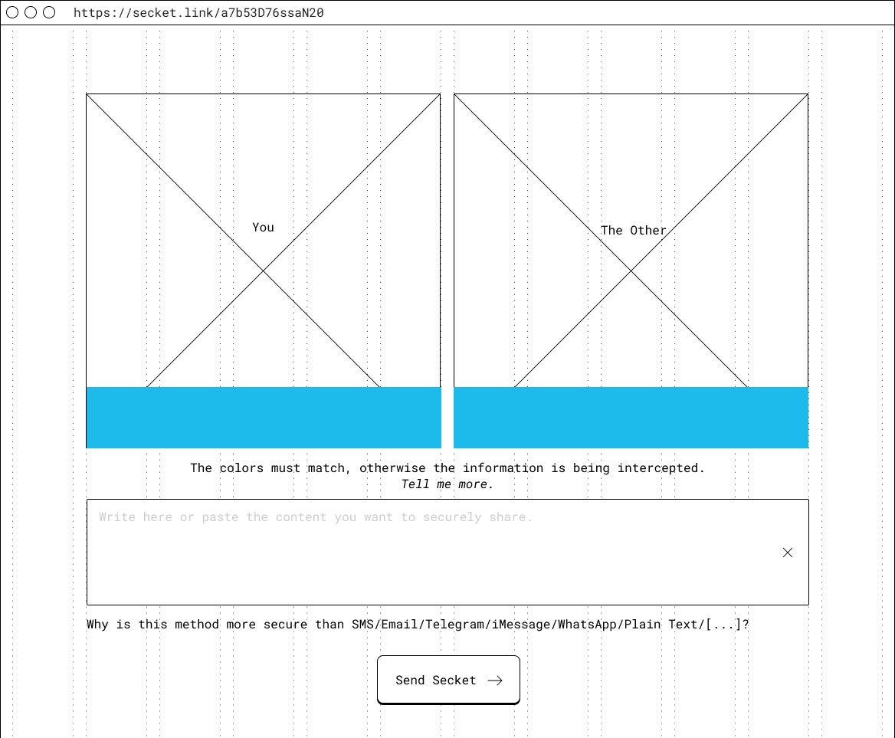

# Secket
Directly send encrypted information via websocket.

Service will be available at [secket.link](https://secket.link).

_The project is being envisioned right now. At the moment this is nothing more than a scratchpad._

1. The information receiver visits secket.link and a random id is generated (aka the room).
2. The link is shared with the information owner through an established insecure channel (sms/email/ecc).
3. The owner visits the same page and a P2P websocket connection is established.
4. A key pair is generated locally on the receiver browser, the private key is kept local, the public part is sent to the secret sender via websocket.
5. A MediaStream channel is opened with an overlay solid color generated from the public key. Optionally also the receiver camera is sent along.
6. The sender receives the public key and the same color is generated locally and shown. Also the MediaStream (with the receiver color overlaid) is shown side by side so she can visually compare the two colors and optionally the identity of the receiver through video.
7. The sender writes (or pastes) the information on text field.
8. The information is encrypted with the receiver public key and sent with P2P to the receiver.
9. The receiver gets the information and decrypts it with the private key.
10. Done.

The process can also be initiated by the sender with the very same procedure afterwards.

### Components:
- [PeerJS](https://peerjs.com) as a wrapper to WebRTC.
- [PeerServer](https://github.com/peers/peerjs-server) to match peers.
- TURN/STUN server to facilitate NAT traverse.

Except for peer match the app core is on browser.

### Advantages:
- No setup needed.
- The private key never leaves the browser.
- The information (even encrypted) is never stored in a central location.
- Everyone can deploy her own remote version.
- Information is ephemeral: never stored in the browser. No history.
- Video verification in the browser.
- Any insecure channel can be used to exchange the link, the video verification happens in the browser.
- If the link has already been used by two peers any other connection won’t be allowed.

### Disadvantages:
- At least one server needs to be maintained to facilitate connection between peers.
- Can be used by bad actors.
- Completely unknown, trust should be gained.

